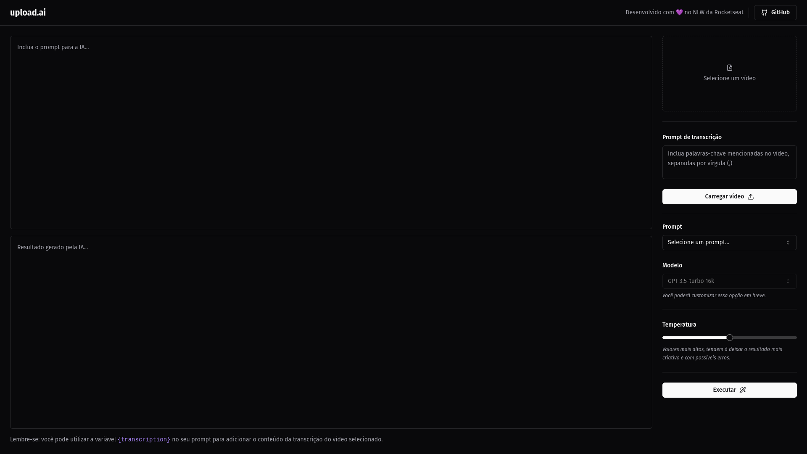

<br/><br/><br/>

# NLW IA
<br/>

Projeto desenvolvido durante o evento NLW IA realizado pela <a href="https://www.rocketseat.com.br/ ">Rocketseat</a>.
<br/><br/>

## 📋 Pré-requisitos

Tenha certeza que você tem instalado:

- [Node.js](https://nodejs.org/en/).
- [Git](https://git-scm.com/).
- [pnpm](https://pnpm.io/).

## 🛠️ Tecnologias

- [Vite JS](https://vitejs.dev/).
- [React JS](https://reactjs.org/).
- [Tailwind CSS](https://tailwindcss.com/).
- [TypeScript](https://www.typescriptlang.org/).
- [Radix UI](https://www.radix-ui.com/).
- [Shadcn/ui](https://shadcn/ui/).
- [Lucide](https://lucide.dev/).
- [Prisma](https://www.prisma.io/).
- [ffmpeg.wasm](https://ffmpegwasm.netlify.app/).

## Extensões do VS Code

- [Tailwind CSS IntelliSense](https://marketplace.visualstudio.com/items?itemName=bradlc.vscode-tailwindcss).
- [PostCSS Language Support](https://marketplace.visualstudio.com/items?itemName=csstools.postcss).
- [Rest Client](https://marketplace.visualstudio.com/items?itemName=humao.rest-client).
- [Prisma](https://marketplace.visualstudio.com/items?itemName=Prisma.prisma).

<br/><br/>

### 🔧 Instalação

Abra o terminal na pasta de cada projeto (web e backend), rode o comando:

```
pnpm i
```
Após executar o comando, aguarde instalar todas as dependências.
Com todas as dependências instaladas, na pasta de cada projeto (web e backend), abra o terminal e rode o comando:

```
pnpm run dev
```
<br/><br/>

### ⚙️ Configuração

Criar o arquivo .env na raiz do projeto backend, para configurar a variável de ambiente *OPENAI_KEY* e colocar a key que você criou na sua conta da <a href="https://openai.com/">OpenAI</a>.<br/><br/>

Para executar as migrations, abra o terminal e rode o comando:

```
pnpm prisma migrate dev
```

Para conferir as tabelas, abra o terminal e rode o comando:

```
pnpm prisma studio
```

Para popular as tabelas, abra o terminal e rode o comando:

```
pnpm prisma db seed
```
<br/><br/><br/>

---
⌨️ com ❤️ por [Developer Fabio](https://gist.github.com/developerfabio) 😊
